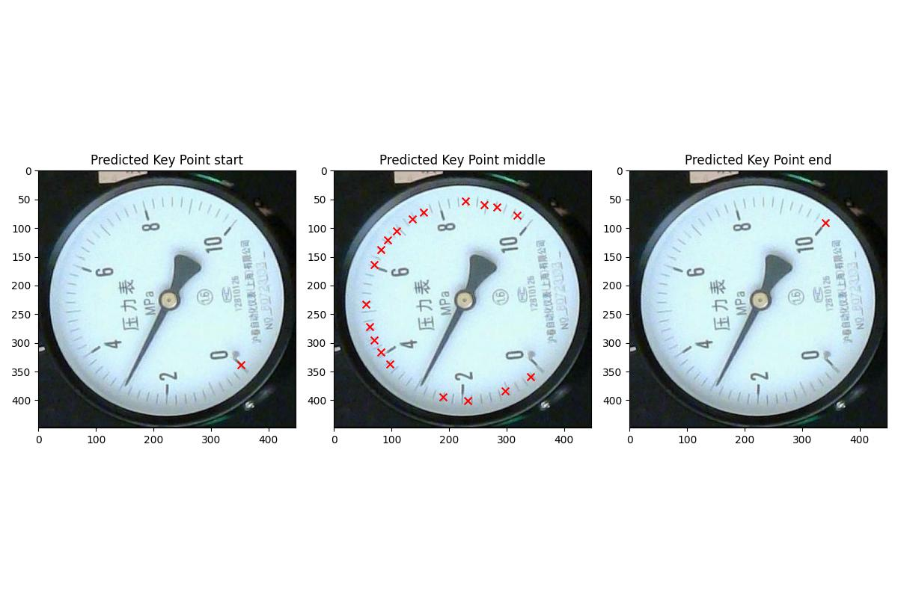

# Keypoint Detection
## 使い方

### モデルの確認とJSONファイルの構築

1. **パッケージのインストール**

    必要なパッケージをインストールします。

    ```
    pip install -r requirements.txt
    ```

2. **モデルの構築**

    `key_point_detection`フォルダ内のコードを使い、キーポイント検出モデルを構築してください。

3. **キーポイント名情報のJSONファイル作成**

    キーポイントの名前と順序を定義したJSONファイルを作成します。

    **例:**
    ```
    {
        "keypoints": [
            { "name": "start" },
            { "name": "middle" },
            { "name": "end" }
        ]
    }
    ```

    **注意:**
    - `"keypoints"`の順序はモデル出力の順番に合わせる必要があります。
    - 順序が一致しない場合、結果が正しく解釈されません。

4. **コマンドの実行**

    以下のコマンドを実行してキーポイント検出を行います。

    ```
    python det_coordinate.py \\
        --input <画像もしくは画像フォルダのパス> \\
        --key_point_model <keypoint検出のモデルのパス> \\
        --base_path <結果を保存するフォルダのパス> \\
        --eval \\
        --json_path <キーポイントのタグ情報が格納されたJSONのパス>
    ```

    **実行後の確認:**
    - 結果は`base_path`内に保存されます。
    - キーポイントの順序が期待と異なる場合、JSONファイル内の順序を修正して再実行してください。

    **結果の例**

    

---

### プログラム内での利用

以下のようにPythonコード内でキーポイント検出を利用できます。

**サンプルコード:**

```
from det_coordinate import imagepath_to_coordinates
import warnings

# xFormersに関する警告を無視
warnings.filterwarnings("ignore", message="xFormers is not available")

# キーポイント検出を実行
result = imagepath_to_coordinates(
    "demo.jpg",              # 入力画像のパス
    "keypoint.pt",           # キーポイント検出モデルのパス
    "keypoint_name.json",    # キーポイント情報JSONのパス
    cpu=True                 # GPUを利用する場合はcpu=Falseに変更
)
```

**実行結果の例:**

```
{
    "start": [[352.93, 338.75]],
    "middle": [
        [297.37, 384.23],
        [189.16, 393.59],
        [55.96, 232.27],
        ...
    ],
    "end": [[340.43, 91.05]]
}
```

---

### 結果の解釈

- **JSONフォーマット:**
    - 各キーポイントの名前がキーとして設定されます。
    - 値はキーポイントの座標リスト $[x, y]$ 形式です。